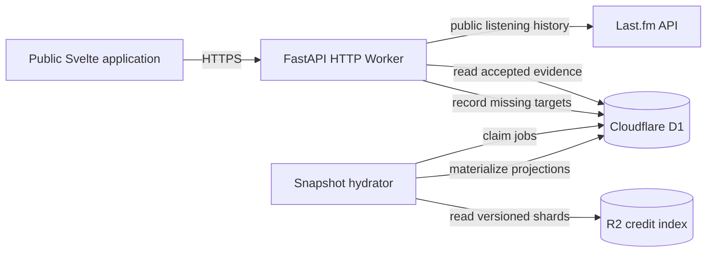

# TIMBRE PALETTE

<p align="center">
  
</p>

Timbre Palette is an experimental web application that transforms a public Last.fm listening history into an instrumental profile. It combines listening data with accepted instrument evidence to describe recurring sound families, acoustic and electronic characteristics, coverage, and an editorial interpretation called the listening temperament.

The project is currently a prototype. Its results are designed to be transparent, reproducible, and explicit about incomplete evidence.

## Features

- Generates an instrumental palette from a public Last.fm profile and a selected listening period.
- Ranks recurring instrument families while preserving evidence and confidence information.
- Describes the balance between acoustic, electric, electronic, sampled, hybrid, and unidentified sound sources.
- Reports track and play coverage instead of presenting incomplete metadata as complete analysis.
- Distinguishes `ready`, `partial`, and `insufficient` analyses through a stable API response contract.
- Produces deterministic editorial observations and an instrument discovery when the available evidence supports them.
- Exposes sourced instrument and sound-family profiles with citations, image credits, and review metadata.
- Generates a downloadable, shareable portrait in the browser.
- Records missing snapshot targets so they can be hydrated asynchronously from the published offline index.

## Services

### Last.fm

Last.fm provides the public listening history used as the input for an analysis. The API reads a profile's top tracks for the requested period; visitors do not authenticate with their Last.fm accounts. A project API key is required when running the real integration.

Last.fm is a listening-history source, not an authoritative source of instrumentation.

### MusicBrainz

MusicBrainz data is consumed exclusively through versioned offline snapshots built by the Rust ETL and published to R2. The application does not call the MusicBrainz API at runtime. Only credits with a resolved identity, supported scope, and explicit instrument mapping enter the serving snapshot.

## API

The backend is a Python application built with FastAPI and designed to run on Cloudflare Workers. It exposes three primary resources:

- `GET /v2/profiles/{username}/analysis` — returns direct track evidence and, when supported, the artist vocabulary.
- `GET /v2/instruments/{slug}` — returns a reviewed instrument or sound-family profile.
- `GET /v2/catalog/stats` — returns a lightweight count from the active snapshot projection.

FastAPI publishes the canonical OpenAPI schema at `GET /openapi.json` and interactive documentation at `GET /docs`. Palette requests return immediately with the available result and never wait for snapshot hydration.

Detailed catalog behavior, persistence, and business rules are maintained in the API documentation:

- [Public API contract](docs/api-contract.md)
- [Catalog architecture](docs/catalog-architecture.md)
- [Editorial publication](docs/editorial-publishing.md)
- [Versioned analysis methodology](docs/methodology.md)

### Architecture



The HTTP Worker reads compact, versioned projections from D1. Missing targets are recorded without blocking the response. The snapshot hydrator groups them by R2 shard and materializes the requested direct-evidence and artist-vocabulary projections asynchronously. The ETL, object layout, publication, and license handling are documented in [MusicBrainz credit index](docs/musicbrainz-credit-index.md).

## Front-end

Both interfaces use Svelte, strict TypeScript, Vite, semantic HTML, and project-owned CSS. The public application is a static build and contains no server credentials or authoritative analysis rules.

### Central Panel

The central panel is the public analysis experience in `web/`. A visitor enters a Last.fm username, selects a listening period, and receives the currently available report. The report is organized into an instrumental portrait, family palette, sound-source balance, discovery, evidence coverage, technical notes, and a shareable image generated locally in the browser.

The interface handles incomplete datasets as first-class states. Sections remain unavailable when coverage or diversity thresholds are not met, and the report identifies whether its data is ready, partial, or insufficient. Instrument details are loaded on demand from the API.

A development-only ASCII portrait workspace is available at `/portrait-preview.html`. Its 20 × 17 editor supports:

- per-family drawings and arbitrary printable ASCII characters;
- click, drag, keyboard-accessible cells, erasing, and horizontal mirroring;
- undo, reset, and live portrait previews;
- browser-local persistence;
- copying either rendered ASCII or source-ready line arrays.

The preview uses the production portrait generator but is excluded from the production build.

### Editorial Panel

> The editorial panel is in an early stage of development.

The separate application in `editorial/` manages instrument and sound-family records. Editors can review descriptions, sound-production notes, optional curiosities, citations, source metadata, further-reading links, images, rights information, and review status.

Changes are stored in the editor's browser and can be exported as a validated JSON review. The exported snapshot is committed to `editorial/src/instruments.json`; the editorial publication workflow validates it, generates idempotent SQL, and synchronizes Cloudflare D1. See [Editorial publication](docs/editorial-publishing.md).

## Local Installation

### Prerequisites

- Git
- Python 3.13 or later
- Node.js 24 or later
- Yarn Classic 1.22

### 1. Clone the repository

```sh
git clone https://github.com/rosa-gus/timbre-palette.git
cd timbre-palette
```

### 2. Install the JavaScript dependencies

```sh
yarn install --frozen-lockfile
```

### 3. Create the Python environment

```sh
python3 -m venv .venv
.venv/bin/python -m pip install -e '.[dev]'
```

### 4. Configure local secrets

Copy the development template:

```sh
cp .dev.vars.example .dev.vars
```

Set `LASTFM_API_KEY` in `.dev.vars` to a valid Last.fm application key. This key is optional when using the mock API. `IMAGE_ASSET_BASE_URL` may remain set to the local Vite origin. Never commit `.dev.vars` or place credentials in frontend environment variables.

### 5. Start the API

To run the API with local D1 migrations:

```sh
yarn dev:api
```

The API is available at `http://localhost:8787`, and its interactive documentation is available at `http://localhost:8787/docs`.

For deterministic development without a Last.fm key or external requests, run the mock API instead:

```sh
yarn dev:api:mock
```

### 6. Start the public front-end

In a second terminal:

```sh
VITE_API_BASE_URL=http://localhost:8787 yarn dev:web
```

Open `http://127.0.0.1:5173/`. The ASCII portrait workspace is available at `http://127.0.0.1:5173/portrait-preview.html`.

### 7. Start the editorial panel

In another terminal:

```sh
yarn dev:editorial
```

Open `http://127.0.0.1:5174/`.

### Validation commands

```sh
.venv/bin/pytest
yarn editorial:validate
yarn typecheck:web
yarn typecheck:editorial
yarn build:web
yarn build:editorial
```

## Guidelines

Timbre Palette follows an honesty-first editorial and technical policy:

- It is not a personality test and makes no scientific, psychological, diagnostic, or behavioral claims.
- The listening temperament is a deterministic editorial interpretation of recurring musical characteristics, not a statement about the listener's identity or personality.
- Published information about an instrument must be supported by legitimate, traceable sources. Citations and review state must remain attached to the claims they support.
- Direct evidence is preferred to inference. When evidence does not support a specific instrument, the system should use a defensible sound family or report the information as unknown.
- Missing or low-confidence evidence must remain visible through coverage, confidence, provenance, and availability states.
- The application does not score musical taste, rank listeners, or imply that one palette is superior to another.

The full editorial policy is documented in [docs/editorial-policy.md](docs/editorial-policy.md).

## Technical Limitations

- Timbre Palette analyzes metadata and reviewed credits; it does not analyze audio, isolate stems, or estimate an instrument's loudness or prominence from a recording.
- Instrument credits are incomplete and unevenly distributed across artists, genres, regions, and release formats. A missing instrument in a report does not imply that it is absent from the music.
- Contemporary music can be especially difficult to document because detailed personnel and instrument credits are often sparse, fragmented across platforms, or omitted from public structured metadata.
- A recording present in MusicBrainz may have no usable instrument relationships, and a release-level credit cannot automatically be treated as evidence for every track.
- Catalog coverage is still limited. Snapshot hydration may improve a later report, but it cannot guarantee complete attribution.
- The offline MusicBrainz index is a versioned derivative snapshot. It can lag behind live edits; its snapshot version, source URL, attribution, and license remain attached to normalized evidence.
- Results depend on the public top-track history returned by Last.fm and therefore do not represent a complete listening archive.

## License

The original source code in this repository is licensed under the [GNU General Public License, version 3](LICENSE.txt);

Third-party software remains subject to the licenses and copyrights of its respective authors. Photographs, videos, fonts, and other third-party media are not relicensed under the GPL; their respective authors and rights holders retain all applicable rights. Asset-specific attribution and licensing information is available in [assets/CREDITS.md](assets/CREDITS.md).
