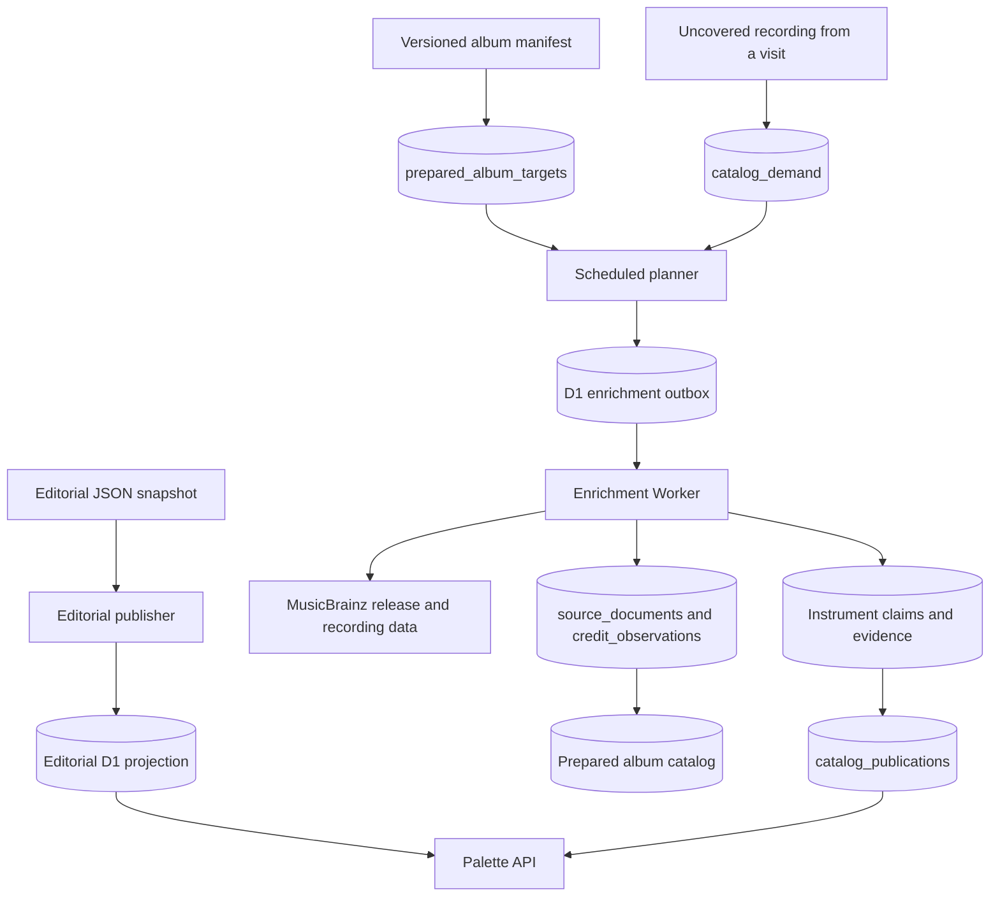

# Catalog Architecture

The catalog has three inputs: the versioned editorial snapshot, the prepared album manifest, and aggregated demand observed during profile analyses. Public requests read only the published catalog. Collection and promotion run asynchronously in the enrichment Worker.



## Catalog units and provenance

- `artists` stores canonical artist identity.
- `album_groups` represents an album as a work.
- `album_releases` represents a concrete edition identified by a MusicBrainz release MBID.
- `album_tracks` maps an edition's track position to a canonical recording.
- Instrumentation belongs to the recording. A release-level credit is not copied to every track automatically.

`source_documents` stores the raw response, request parameters, content hash, and parser version. `credit_observations` stores the raw relationships, including relationships that are not yet eligible for the public palette. This allows taxonomy changes to be reprocessed without fetching MusicBrainz again.

The collector preserves the source, performer, scope, original credit, and production metadata for each relationship. `instrument`, `vocal`, and `vocals` relationships may be promoted to claims when their MBID or name has an explicit catalog mapping. `programming`, `samples`, and `sampled` remain observations.

External names are resolved only through explicit aliases or external identifiers. The system does not create slugs through fuzzy text matching. Family mappings are valid for a family claim and do not imply a specific instrument or sound nature.

Mapping migrations apply to new promotions. Existing candidates and historical evidence are preserved; publishing a new alias does not silently rewrite prior observations or claims.

## Editorial snapshot

The editorial snapshot is published independently from instrumentation evidence.
Its review and D1 synchronization process is documented in
[Editorial publication](editorial-publishing.md).

## Prepared album manifest

`catalog/prepared-albums.json` is versioned with the source code and targets concrete releases rather than ambiguous album names. Its entries contain a release MBID, artist, title, editorial genre, and priority.

Validate the manifest with:

```sh
yarn catalog:validate
```

Generate D1 import SQL with:

```sh
yarn catalog:sql > /tmp/timbre-palette-albums.sql
```

Changes to the published album manifest must be accompanied by a migration or another controlled publication step. Editorial changes use the separate [editorial publication flow](editorial-publishing.md) and do not create one migration per review. The scheduled planner processes at most 20 release targets per cycle and tracks target state independently of Queue delivery.

## Demand aggregation

When a visited track has no accepted evidence, the scheduler records only its artist, title, MBID, play weight, and occurrence count in `catalog_demand`. Usernames and complete listening histories are not persisted.

Repeated demand is deduplicated. A cached source document prevents redundant external requests. A `503` response is treated as a transient failure, not as evidence that a recording has no credits.

## Enrichment and publication

Track and release jobs use the same Queue contract. Release jobs use `job_type: "release"`, `target_mbid`, and `stage: "source"`. The D1 outbox is the source of truth; Queue delivery is at-least-once, so processing and writes must be idempotent.

The Worker shares one rate-limited MusicBrainz transport across track and release collection. A release job stores all recoverable stages before completing and can resume after a failure without restarting external collection unnecessarily.

New claims enter the public projection only when they have an explicit catalog mapping and direct recording- or track-level evidence. `catalog_publications` identifies the active revision. The analysis never treats raw observations, unresolved candidates, release context, or pending work as published claims.

Consult the [MusicBrainz API documentation](https://musicbrainz.org/doc/MusicBrainz_API) before changing request frequency, client identification, or the set of collected relationships.
