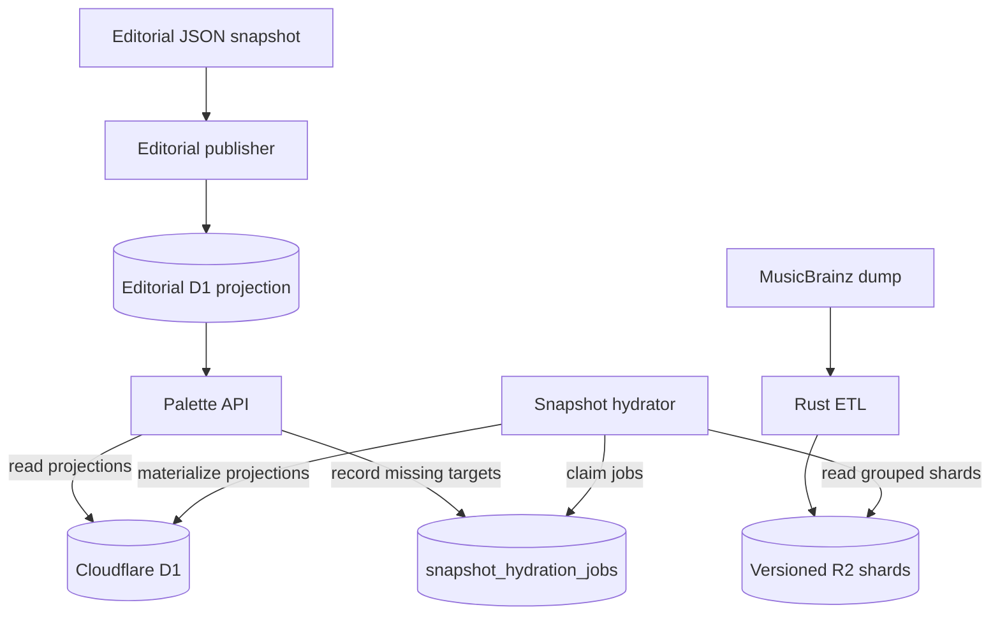

# Catalog Architecture

The backend combines two independently published inputs: the reviewed editorial catalog and a versioned MusicBrainz serving snapshot. Public requests read only D1 projections and never fetch MusicBrainz data directly.

## Public read model

The API v2 reads the active snapshot metadata and its compact projections for recording evidence, track aliases, and artist vocabulary. A request with absent data records deduplicated hydration targets in D1 and returns the available state immediately.

Direct track evidence and Artist Vocabulary are separate products. Vocabulary never enters `Track.layers`, never raises direct-evidence coverage, and cannot unlock discovery, sound balance, or temperament.

## Snapshot hydration

The snapshot hydrator is the only runtime component that reads the R2 credit index. A two-minute Cron claims one pending D1 job, calculates its immutable object key, reads one shard, and writes an idempotent projection transaction. Track aliases enqueue a follow-up recording job; this keeps each invocation within the Workers Free CPU budget.

Hydration is offline-only: an R2 miss remains a miss for that published snapshot. There is no live MusicBrainz request path. Snapshot version and evidence provenance remain attached to every materialized result.

Only instruments and families resolved by the ETL against the project taxonomy are published. Unresolved credits are excluded from the serving output.

## Editorial catalog

The editorial snapshot is published independently from listening evidence. Its review and D1 synchronization process is documented in [Editorial publication](editorial-publishing.md).

External names are resolved only through explicit aliases or identifiers. Family mappings support family-level claims and do not imply a specific instrument or sound nature.

## Provenance and refreshes

Each serving publication has an immutable snapshot version, schema version, manifest hash, source URL, license, and attribution. A refresh builds and validates new Rust ETL artifacts, uploads them under a new R2 prefix, and activates the new snapshot metadata only after publication succeeds.

Existing D1 projections remain associated with their source snapshot. Hydration jobs target one explicit version, which prevents data from different dumps from being combined silently.
